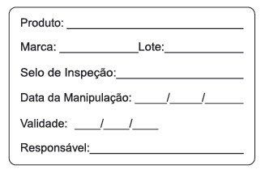
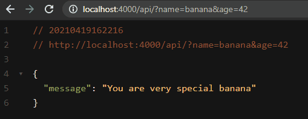

<div align="center">
  
  <h1><strong>INMANA API</strong><br>&nbsp;Inventory Management</h1>

  ### 👨‍🍳 Loss prevention with intelligent _best before date_ management in a restaurant 👨‍🍳
  <a href="https://nextlevelweek.com/">This project was created during Rockeseat's NLW event</a>
</div>
<br>

### 🍔 About the project
* In every restaurant, in the kitchen, every manipulable food that is opened, like a jar of mayonnaise, this Anvisa label has to be attached. So, let's help the restaurant to use this resource intelligently so that no food spoils:

  

* Restaurants and supplies can be registered;
* It must be possible to view information from a procurement;
  - When does the food expire?
  - When was the food manipulated?
* A list of items due every week should be generated for each of the restaurants;
* The list of items should be sent to the restaurant's email.

<br>

### 🚀 Technologies used in this project
* Elixir Programming Language
* Phoenix Web Framework
* Credo - a static code analysis tool for the Elixir language with a focus on teaching and code consistency.

<br>

<div align="center">
Made with ♥ by Maiqui Tomé 😀
<br>

*Reach out to me* 👇

[](https://codepen.io/maiquitome)
[](https://www.youtube.com/channel/UCoXn0XyxLsKpIE5px0UNuEw)
[](https://medium.com/@maiquitome)
[](https://www.linkedin.com/in/maiquitome)
[](https://www.instagram.com/maiquitome)
[](https://www.facebook.com/maiquitome)
[](https://twitter.com/MaiquiTome)
</div>

<br>
<div align="center">

  # Creating the project from scratch

</div>

* [Video 1 - Reinforcing concepts](#Video-1-Reinforcing-concepts)
  - [Creating the project](#Creating-the-project)
  - [Creating the database](#Creating-the-database)
  - [Install Credo](#Install-credo)
  - [Creating welcomer](#Creating-welcomer)
  - [Creating a welcome route](#Creating-a-welcome-route)
  - [Creating the controller](#Creating-the-controller)
  - [Welcomer final result](#Welcomer-final-result)
* [Video 2 - Creating the restaurant](#Video-2-Creating-the-restaurant)
  - [Restaurant migration](#Restaurant-migration)
  - [Restaurant schema](#Restaurant-schema)
  - [Restaurant create](#Restaurant-create)
  - [Restaurant fallback controller](#Restaurant-fallback-controller)
  - [Restaurant error view](#Restaurant-error-view)
  - [Restaurant view](#Restaurant-view)
  - [Restaurant route](#Restaurant-route)
  - [Create restaurant facade](#Create-restaurant-facade)

<div align="center">

  # VIDEO 1  Reinforcing concepts

</div>

### Creating the project
```bash
$ mix phx.new inmana --no-html --no-webpack
```
### Creating the database
```bash
$ cd inmana
```
```bash
$ mix ecto.create
```
### Install Credo
- https://github.com/rrrene/credo
- in _mix.exs_ add:
  ```elixir
  defp deps do
    [
      {:credo, "~> 1.5", only: [:dev, :test], runtime: false}
    ]
  end
  ```
- and run:
  ```
  $ mix deps.get

  $ mix credo.gen.config

  $ mix credob
  ```

### Creating welcomer

About welcomer
* Receive a name and age from the user
* We have to treat the username for wrong entries, like "BaNaNa", "banana \n"
* If the user calls "Banana" and is 42 years old, he receives a special message
* If the user is of age, he receives a normal message
* If the user is a minor, we return an error

Creating the welcomer file
```elixir
# lib/inmana/welcome.ex

defmodule Inmana.Welcomer do
  # Receive a name and age from the user
  def welcome(%{"name" => name, "age" => age}) do
    age = String.to_integer(age)

    # We have to treat the username for wrong entries, like "BaNaNa", "banana \n"
    name
    |> String.trim()
    |> String.downcase()
    # avaliar
    |> evaluate(age)
  end

  # If the user calls "Banana" and is 42 years old, he receives a special message
  # %{"name" => "banana", "age" => "42"} |> Inmana.Welcomer.welcome
  defp evaluate("banana", 42) do
    {:ok, "You are very special banana"}
  end

  # If the user is of age, he receives a normal message
  defp evaluate(name, age) when age >= 18 do
    {:ok, "Welcome #{name}"}
  end

  # If the user is a minor, we return an error
  defp evaluate(name, _age) do
    {:error, "You shall not pass #{name}"}
  end
end
```

### Creating a welcome route
```elixir
#lib/inmana_web/router.ex

scope "/api", InmanaWeb do
  pipe_through :api

  get "/", WelcomeController, :index
end
```
### Creating the controller
```elixir
# lib/inmana_web/controllers/welcome_controller.ex

defmodule InmanaWeb.WelcomeController do
  use InmanaWeb, :controller
  alias Inmana.Welcomer

  def index(conn, params) do
    params
    |> Welcomer.welcome()
    |> handle_response(conn)
  end

  defp handle_response({:ok, message}, conn) do
    render_response(conn, message, :ok)
  end

  defp handle_response({:error, message}, conn) do
    render_response(conn, message, :bad_request)
  end

  defp render_response(conn, message, status) do
    conn
    # Plug.Conn.put_status/2
    |> put_status(status)
    # Phoenix.Controller.json
    |> json(%{message: message})
  end
end
```
### Welcomer final result




<div align="center">

  # VIDEO 2 Creating the restaurant

</div>

### Restaurant migration

Command to create the restaurant migration
```elixir
$ mix ecto.gen.migration create_restaurants_table
```

Changing the restaurant migration file
```elixir
# priv/repo/migrations/20210420113131_create_restaurants_table.exs

defmodule Inmana.Repo.Migrations.CreateRestaurantsTable do
  use Ecto.Migration

  def change do
    create table(:restaurants) do
      add :email, :string
      add :name,  :string

      timestamps()
    end

    create unique_index(:restaurants, [:email])
  end
end
```

Setting up UUID
```elixir
# config/config.exs

config :inmana,
  ecto_repos: [Inmana.Repo]

# after the above existing code, add this code:

config :inmana, Inmana.Repo,
  migration_primary_key: [type: :binary_id],
  migration_foreign_key: [type: :binary_id]
```

Command to run the restaurant migration
```bash
$ mix ecto.migrate
```

### Restaurant schema
```elixir
# lib/inmana/restaurant.ex

defmodule Inmana.Restaurant do
  use Ecto.Schema
  import Ecto.Changeset

  @primary_key {:id, :binary_id, autogenerate: true}

  @required_params [:email, :name]

  # By default all keys except the :__struct__ key are encoded.
  # then we need to tell Jason.Encoder to render the fields to json
  @derive {Jason.Encoder, only: @required_params ++ [:id]}

  # iex> Jason.encode(%{name: "Maiqui", last_name: "Tomé"})
  # {:ok, "{\"last_name\":\"Tomé\",\"name\":\"Maiqui\"}"}
  #
  # iex> Jason.encode!(%{name: "Maiqui", last_name: "Tomé"})
  # "{\"last_name\":\"Tomé\",\"name\":\"Maiqui\"}"
  #
  # iex> Jason.encode!(%Inmana.Restaurant{})
  # "{\"email\":null,\"name\":null,\"id\":null}"

  schema "restaurants" do
    field :email, :string
    field :name, :string

    timestamps()
  end

  def changeset(params) do
    %__MODULE__{}
    # To create a changeset using the schema, we are going to use Ecto.Changeset.cast/3
    |> cast(params, @required_params)
    |> validate_required(@required_params)
    |> validate_length(:name, min: 2)
    |> validate_format(:email, ~r/@/)
    |> unique_constraint([:email])
  end
end
```

### Restaurant create
```elixir
# lib/inmana/restaurants/create.ex

defmodule Inmana.Restaurants.Create do
  alias Inmana.{Repo, Restaurant}

  def call(params) do
    params
    |> Restaurant.changeset()
    |> Repo.insert()
    |> handle_insert()
  end

  defp handle_insert({:ok, %Restaurant{}} = result), do: result

  defp handle_insert({:error, result}) do
    {:error, %{result: result, status: :bad_request}}
  end
end
```
### Restaurant controller
```elixir
# lib/inmana_web/controllers/restaurants_controller.ex

defmodule InmanaWeb.RestaurantsController do
  use InmanaWeb, :controller

  alias Inmana.Restaurant
  alias InmanaWeb.FallbackController

  action_fallback FallbackController

  def create(conn, params) do
    with {:ok, %Restaurant{} = restaurant} <- Inmana.create_restaurant(params) do
      conn
      |> put_status(:created)
      |> render("create.json", restaurant: restaurant)
    end
  end
end
```

### Restaurant fallback controller
```elixir
# lib/inmana_web/controllers/fallback_controller.ex

defmodule InmanaWeb.FallbackController do
  use InmanaWeb, :controller

  def call(conn, {:error, %{result: result, status: status}}) do
    conn
    |> put_status(status)
    |> put_view(InmanaWeb.ErrorView)
    |> render("error.json", result: result)
  end
end
```

### Restaurant error view
```elixir
# lib/inmana_web/views/error_view.ex

defmodule InmanaWeb.ErrorView do
  use InmanaWeb, :view

  def template_not_found(template, _assigns) do
    %{errors: %{detail: Phoenix.Controller.status_message_from_template(template)}}
  end

  def render("error.json", %{result: %Ecto.Changeset{} = changeset}) do
    %{message: translate_errors(changeset)}
  end

  defp translate_errors(changeset) do
    Ecto.Changeset.traverse_errors(changeset, fn {msg, opts} ->
      Enum.reduce(opts, msg, fn {key, value}, acc ->
        String.replace(acc, "%{#{key}}", to_string(value))
      end)
    end)
  end
end
```

### Restaurant view
```elixir
# lib/inmana_web/views/restaurants_view.ex

defmodule InmanaWeb.RestaurantsView do
  use InmanaWeb, :view

  def render("create.json", %{restaurant: restaurant}) do
    %{
      message: "Restaurant created!",
      restaurant: restaurant
    }
  end
end
```

### Restaurant route
```elixir
# lib/inmana_web/router.ex

scope "/api", InmanaWeb do
    pipe_through :api

    get "/", WelcomeController, :index

    # add this code:
    post "/restaurants", RestaurantsController, :create
  end
```

### Create restaurant facade
```elixir
# lib/inmana.ex

defmodule Inmana do
  alias Inmana.Restaurants.Create

  defdelegate create_restaurant(params), to: Create, as: :call
end
```

<br />

<div align="center">
Made with ♥ by Maiqui Tomé 😀
<br />

*Reach out to me* 👇

[](https://codepen.io/maiquitome)
[](https://www.youtube.com/channel/UCoXn0XyxLsKpIE5px0UNuEw)
[](https://medium.com/@maiquitome)
[](https://www.linkedin.com/in/maiquitome)
[](https://www.instagram.com/maiquitome)
[](https://www.facebook.com/maiquitome)
[](https://twitter.com/MaiquiTome)
</div>
